# Familiar

[](https://github.com/seethroughlab/familiar/actions/workflows/ci.yml)
[](https://github.com/seethroughlab/familiar/actions/workflows/release.yml)
[](LICENSE)

**Describe what you want to hear.** Familiar is a local music player that understands the *sound* of your music, not just its metadata. Ask for "something that sounds like rain on a window" and it actually works.

**Your music, your server, your data.** Runs entirely on your hardware - no cloud dependency, no subscriptions, no data leaving your network.

**Community-powered analysis.** Share anonymized audio fingerprints with other users. New installations benefit instantly from pre-computed analysis, skipping hours of processing.

## How Familiar Compares

| | Familiar | Navidrome | Jellyfin | Plex |
|---|---|---|---|---|
| AI chat + playlist creation | Yes | — | — | — |
| Semantic audio search | Yes (CLAP) | — | — | — |
| Audio feature analysis | BPM, key, energy, mood | — | Basic | Basic |
| Community analysis cache | Yes | — | — | — |
| Self-hosted / no cloud | Yes | Yes | Yes | Partial |
| Music video playback | Yes | — | Yes | Yes |
| Smart playlists | Rules-based | — | — | Yes |
| Native Mac/iPhone clients | Yes | — | Apps | Apps |

## Screenshots

**Listening happens in the Mac and iPhone apps** ([`familiar-apple`](https://github.com/seethroughlab/familiar-apple)). The browser is the management surface — the two are deliberately different tools, not the same app twice.

### The apps

| Discover | Artists |
|:--:|:--:|
| 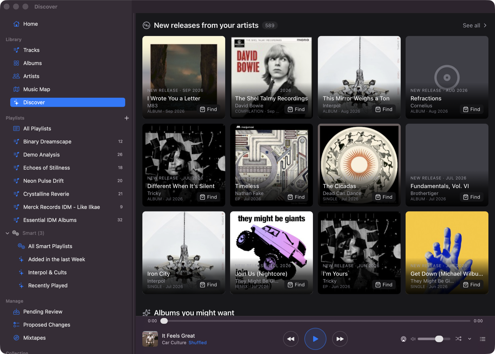 | 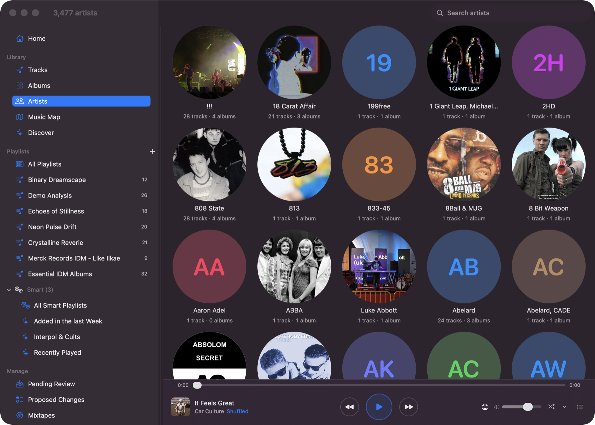 |

| Music Map | Albums |
|:--:|:--:|
| 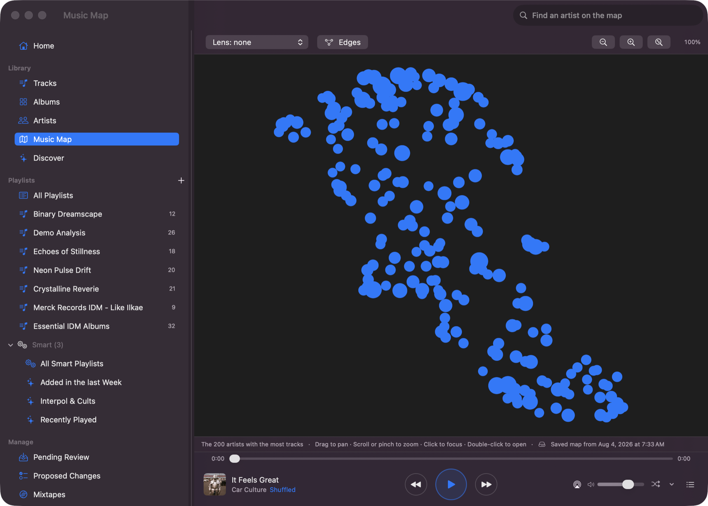 | 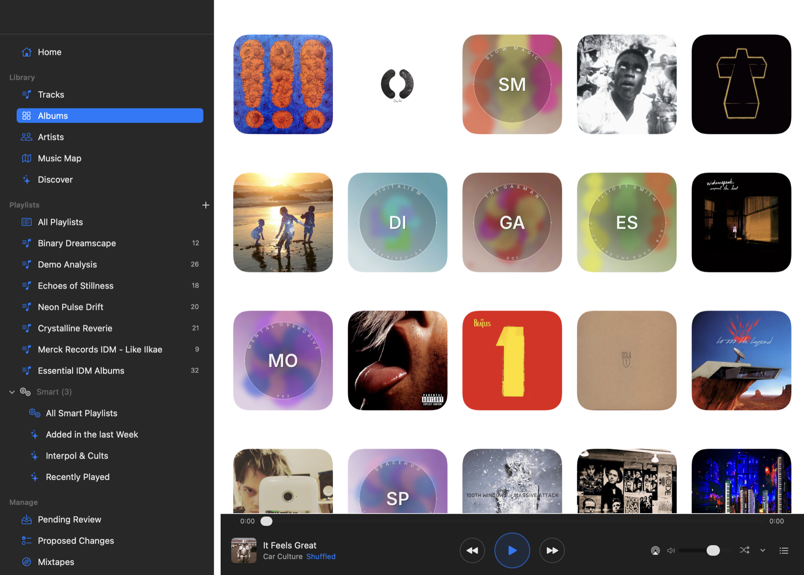 |

### The web app

Three destinations — the library, the tools you run against it, and the server underneath.

| Library | Tools |
|:--:|:--:|
| 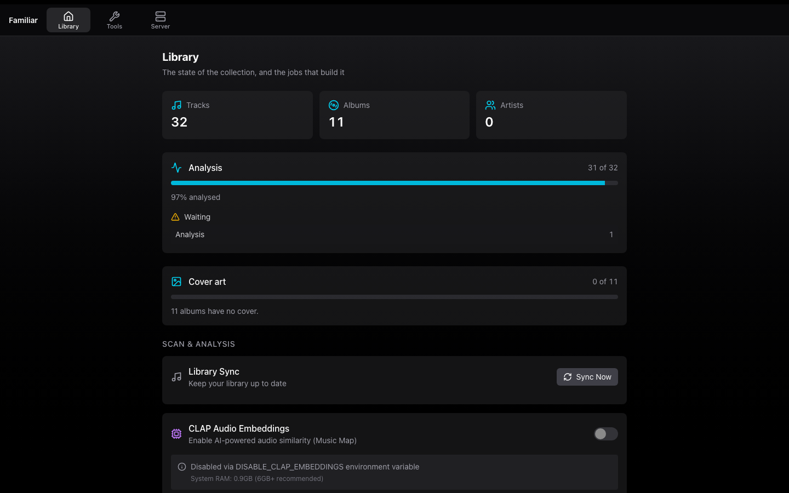 | 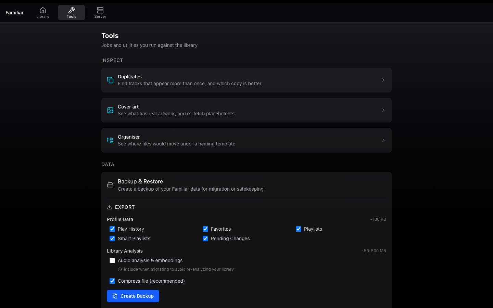 |

<details>
<summary><strong>More screenshots</strong></summary>

| Server | Duplicates |
|:--:|:--:|
| 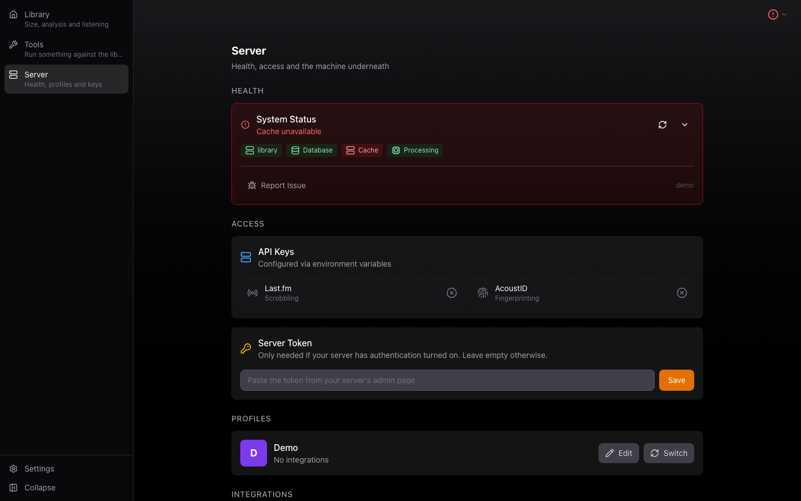 | 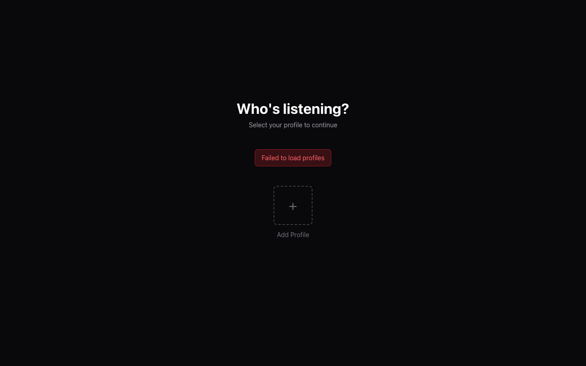 |

| Artist cleanup |
|:--:|
| 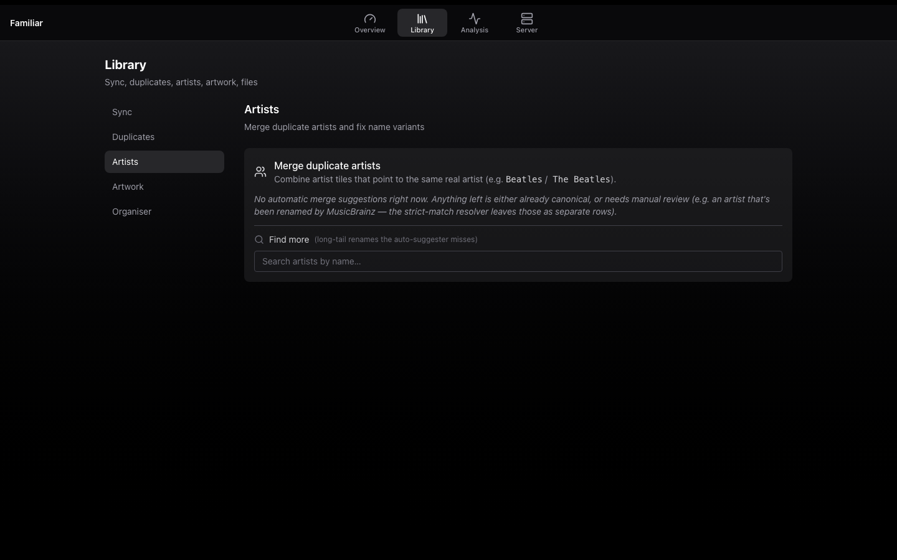 |

| Smart playlists (Mac) | Mobile |
|:--:|:--:|
| 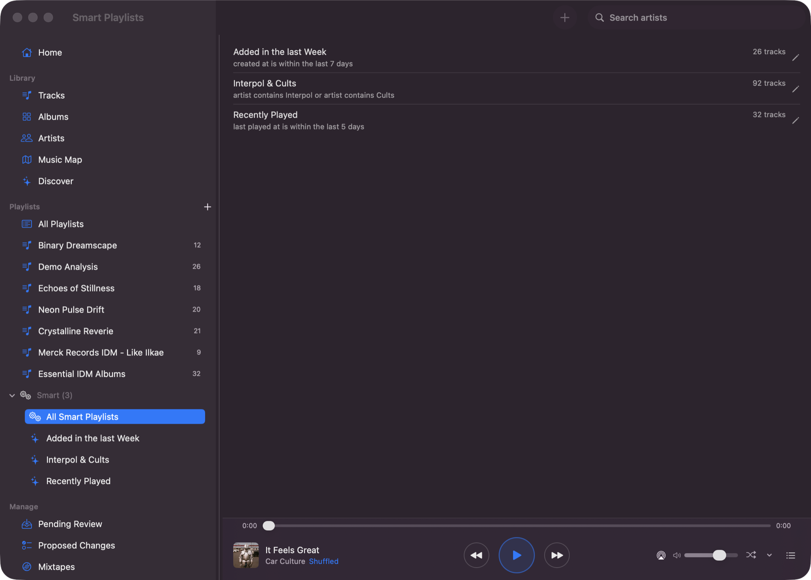 | 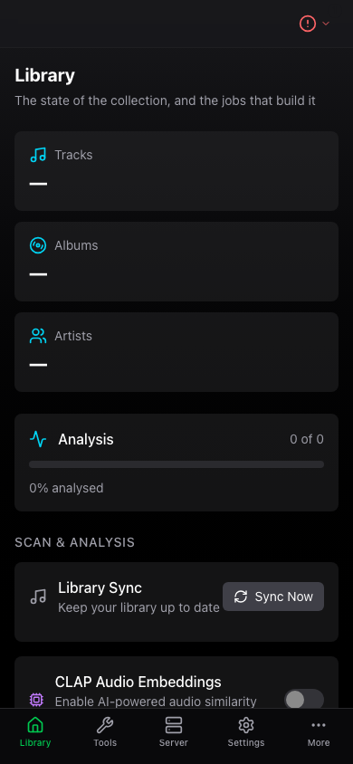 |

</details>

## Features

### Discovery & Search
- **Semantic audio search** - Describe the sound you want: "upbeat with synths", "acoustic and melancholy"
- **AI chat assistant** - 27 tools for search, playback, metadata correction, and playlist creation. Pick Anthropic (Claude) or any OpenAI-compatible endpoint (OpenAI, Groq, OpenRouter, LocalAI, vLLM, LM Studio, Ollama `/v1`)
- **Find similar tracks** - Click any track to find sonically similar music via CLAP embeddings
- **Mood Grid** - 2D scatter plot by energy and valence (happy/sad × calm/energetic)
- **Music Map** - Ego-centric similarity map. Click any artist to center the view
- **3D Explorer** - Navigate a 3D space of artists with hover-to-preview audio

<details>
<summary><strong>Available AI Tools (27)</strong></summary>

| Tool | Description |
|------|-------------|
| **Search & Discovery** | |
| `search_library` | Text search across title, artist, album, genre |
| `semantic_search` | Natural language search by mood/style via CLAP embeddings |
| `find_similar_tracks` | Find sonically similar tracks using audio embeddings |
| `filter_tracks` | Filter by BPM, energy, key, danceability, valence, favorites, play history |
| `get_similar_artists_in_library` | Find similar artists (via Last.fm) that exist in your library |
| **Library Info** | |
| `get_library_stats` | Total tracks, artists, albums, top genres |
| `get_library_genres` | List all genres with track counts |
| `get_visible_tracks` | Get tracks currently shown in the UI |
| `get_track_details` | Detailed track info including audio features |
| `get_track_analysis` | Deep musical analysis (harmonic, melodic, rhythmic, structural) |
| **Playback** | |
| `queue_tracks` | Add tracks to the playback queue |
| `control_playback` | Play, pause, next, previous, shuffle |
| `select_diverse_tracks` | Ensure variety across artists/albums |
| `create_playlist_from_items` | Create playlist from a list of artists/albums/tracks |
| **Discovery** | |
| `search_bandcamp` | Search Bandcamp for albums/tracks to purchase |
| `recommend_bandcamp_purchases` | Suggest albums based on your listening history |
| `get_feature_distribution` | Get statistical distribution of audio features |
| `get_available_mood_tags` | List all mood/genre/style tags available for filtering |
| `fetch_webpage` | Extract music references from a URL for playlist creation |
| **Metadata Correction** | |
| `lookup_correct_metadata` | Look up correct metadata from MusicBrainz |
| `propose_metadata_change` | Propose a metadata fix for user review |
| `get_album_tracks` | Get all tracks from a specific album |
| `mark_album_as_compilation` | Set album_artist for compilation albums |
| `propose_album_artwork` | Search and propose album artwork from Cover Art Archive |
| `find_duplicate_artists` | Find artists with variant spellings |
| `merge_duplicate_artists` | Propose merging duplicate artist names |
| **Track Identification** | |
| `identify_track` | Find a track by title and artist in library or externally |

</details>

### Playback & Experience
- **Synced lyrics** - Auto-scrolling lyrics display fetched from LRCLIB.net
- **Music video playback** - Download and match music videos from YouTube
- **Keyboard shortcuts** - Full keyboard control (press `?` for help)
- **Multi-profile support** - Each household member gets their own favorites and history

### Library Management
- **Fast scanning with community cache** - Pre-computed analysis from other users speeds up initial scan
- **Audio analysis** - BPM, key detection, energy, danceability, and more via librosa
- **CLAP embeddings** - Semantic audio search powered by LAION's CLAP model
- **Smart playlists** - Dynamic playlists with rules for BPM, key, energy, genre, and more
- **Metadata editing** - Right-click to edit, AI-assisted corrections, duplicate artist detection
- **AcoustID fingerprinting** - Identify unknown tracks
- **Cloud backup** - S3 Glacier Deep Archive backup (~$1/TB/month) with scheduled backups and restore

### Native Clients & Remote Access
- **Mac and iPhone clients** - Listening happens in the native apps from
  [`familiar-apple`](https://github.com/seethroughlab/familiar-apple)
- **Offline listening** - Native clients handle downloaded tracks and mobile playback
- **Lock screen controls** - Media notifications and controls in the native clients
- **Works over Tailscale** - Access your library anywhere with HTTPS

### Sharing
- **Listening sessions** - Stream what you're playing to friends in real time over WebRTC. Open the Radio panel to host, share the code or link, friends join from any browser - no account, no shared network. Participant list with kick, in-session chat, optional password. *Host from a desktop browser; iOS clients can join sessions but cannot host yet.*

### Integrations
- **Last.fm scrobbling** - Automatic scrobbling, love/unlove tracks
- **Bandcamp discovery** - Search and get purchase recommendations

## Quick Start

On Linux:

```bash
git clone https://github.com/seethroughlab/familiar.git
cd familiar/docker
cp .env.example .env
# Edit .env: set MUSIC_LIBRARY_PATH and FRONTEND_URL
docker compose -f docker-compose.prod.yml up -d
```

**On macOS or Windows, add `-f docker-compose.desktop.yml`.** The production compose file logs to
`journald`, which is Linux-only, and Docker Desktop's Linux VM does not have it — the run fails with
*"failed to initialize logging driver: journald"*. On macOS `./start.sh` detects this and adds the
override for you.

Access at http://localhost:4400. API keys are configured in your `.env` file — open **Library** in the top bar to manage your library and start a scan. The first run downloads about 7 GB.

Step-by-step guides, no prior Docker experience assumed:

| | |
|---|---|
| **macOS** | [Installing Familiar on your Mac](docs/MACOS_BEGINNER.md) · [reference guide](docs/MACOS.md) |
| **Synology** | [Container Manager, DSM 7.2+](docs/INSTALLATION.md#synology-nas) |
| **OpenMediaVault** | [Services → Compose](docs/INSTALLATION.md#openmediavault) |
| **Windows, Linux, other NAS** | [Installation Guide](docs/INSTALLATION.md) |

Or use [the install page](https://familiar.seethroughlab.com/#install), which asks which machine you are installing on and shows only that path.

## Requirements

- Docker Engine 24.0+ / Docker Compose v2
- x86_64 or ARM64
- Music library accessible via filesystem mount
- Tested on macOS, Windows, Linux, OpenMediaVault and Synology

**Memory is the thing to check.** Familiar itself runs in 2–4 GB, but the CLAP model that listens to
your music peaks at about 4 GB while analysing, so a machine with 8 GB or less — most NAS boxes, and
a Raspberry Pi — wants `DISABLE_CLAP_EMBEDDINGS=true`. You keep the library, the tags, BPM, key,
energy and mood, and smart playlists; you lose the features that compare how tracks *sound*, which
includes Find Similar and suggested tracks. It can be enabled later on a bigger machine.

This used to be documented as an ARM64 caveat and as "4 GB recommended". Both were wrong: the
constraint is memory rather than architecture, and 4 GB is what the model alone needs.

## Documentation

- **[Installation Guide](docs/INSTALLATION.md)** - Docker, OpenMediaVault, Synology NAS, and development setup
- **[Architecture](docs/ARCHITECTURE.md)** - Current server/web/native-client boundaries
- **[macOS Guide](docs/MACOS.md)** - Docker Desktop setup, Apple Silicon, music library paths
- **[Configuration](docs/CONFIGURATION.md)** - Environment variables, API keys, Tailscale HTTPS, cloud backup
- **[Library Browser API](docs/LIBRARY_BROWSERS.md)** - Create custom 2D/3D library visualizations
- **[REST API Reference](docs/REST-API.md)** - Backend REST API documentation
- **[Contributing](CONTRIBUTING.md)** - Local workflow, guardrails and PR checks

## Coming Soon

Features planned for future releases:

### Multi-Room Audio
Play to Sonos speakers and AirPlay devices in addition to browser audio. Control playback across multiple rooms with per-room volume controls.

### Bring your own assistant
Familiar has no built-in LLM provider. It exposes its library as an [MCP](https://modelcontextprotocol.io) server (ADR-0043), so Claude Desktop, Claude Code, or any other MCP client can search the library, inspect the analysis and build playlists using your own subscription. Nothing here holds an API key on your behalf.

## Beta Feedback

Familiar is in active development and we'd love your feedback!

**What's most helpful:**
- Bug reports with steps to reproduce
- Feature requests with use cases
- Performance issues (especially on NAS devices)
- UI/UX suggestions

**How to report:**
- [GitHub Issues](https://github.com/seethroughlab/familiar/issues) - Bugs and feature requests
- Include your platform, Docker version, and relevant logs (`docker logs familiar-api`)

## Project Structure

```
familiar/
├── backend/          # Python FastAPI backend
│   ├── app/
│   │   ├── api/      # API routes
│   │   ├── db/       # Database models
│   │   ├── services/ # Business logic + background tasks
│   │   └── utils/    # Utilities
│   └── tests/
├── packages/
│   ├── frontend/     # Shared React code for web, embed and visualizer entry points
│   │   └── src/
│   │       ├── api/        # API client modules
│   │       ├── app/        # Routes and app shell
│   │       ├── components/
│   │       ├── hooks/
│   │       ├── panels/     # Library, tools and server panels
│   │       ├── screens/    # Top-level web destinations
│   │       ├── services/
│   │       └── stores/     # Zustand state
│   ├── web/          # Vite web/admin/embed/visualizer entry points
│   └── visualizers/  # Bundled visualizer documents and examples
├── docker/           # Docker configuration
└── docs/             # Documentation
```

## Contributing

Contributions are welcome. Please read [CONTRIBUTING.md](CONTRIBUTING.md) before submitting PRs.

## License

MIT License - see [LICENSE](LICENSE) for details.
