# Familiar

[](https://github.com/seethroughlab/familiar/actions/workflows/ci.yml)
[](https://github.com/seethroughlab/familiar/actions/workflows/release.yml)
[](LICENSE)

**Describe what you want to hear.** Familiar is a local music player that understands the *sound* of your music, not just its metadata. Ask for "something that sounds like rain on a window" and it actually works.

**Your music, your server, your data.** Runs entirely on your hardware - no cloud dependency, no subscriptions, no data leaving your network.

**Community-powered analysis.** Share anonymized audio fingerprints with other users. New installations benefit instantly from pre-computed analysis, skipping hours of processing.

## How Familiar Compares

| | Familiar | Navidrome | Jellyfin | Plex |
|---|---|---|---|---|
| AI chat + playlist creation | Yes | — | — | — |
| Semantic audio search | Yes (CLAP) | — | — | — |
| Audio feature analysis | BPM, key, energy, mood | — | Basic | Basic |
| Community analysis cache | Yes | — | — | — |
| Self-hosted / no cloud | Yes | Yes | Yes | Partial |
| Music video playback | Yes | — | Yes | Yes |
| Smart playlists | Rules-based | — | — | Yes |
| Mobile PWA | Yes | Web only | Web + apps | Apps |

## Screenshots

| Library | AI Chat |
|:--:|:--:|
| 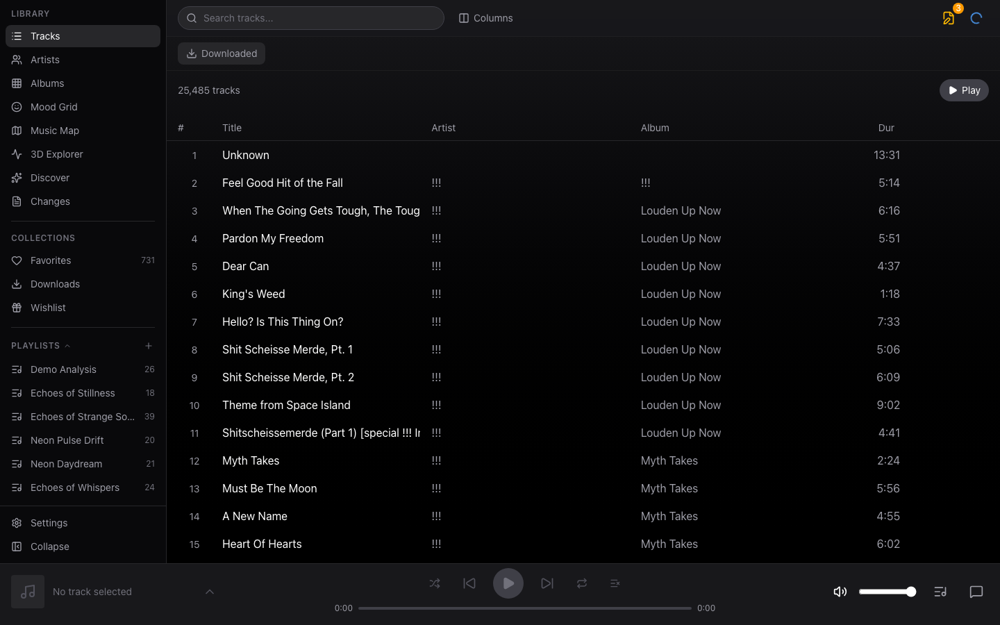 | 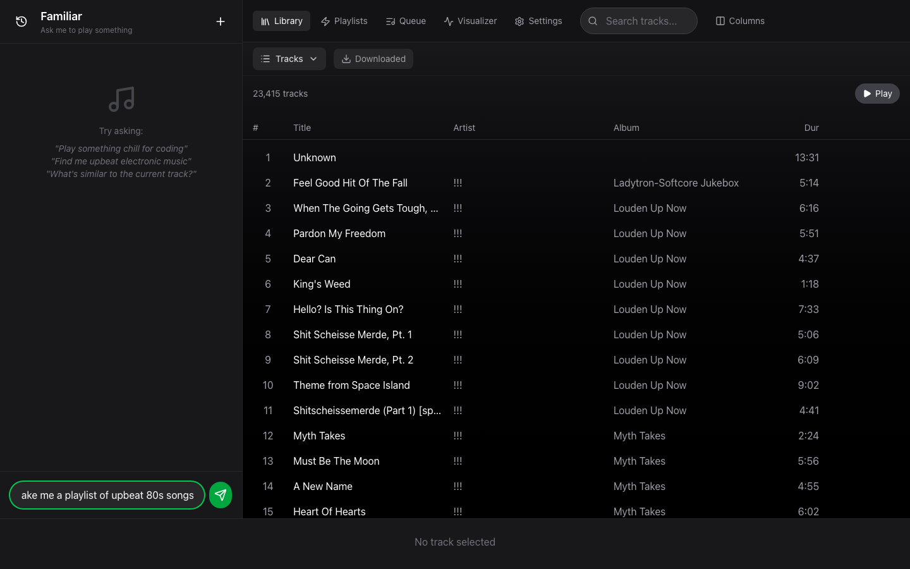 |

| Artists | 3D Explorer |
|:--:|:--:|
| 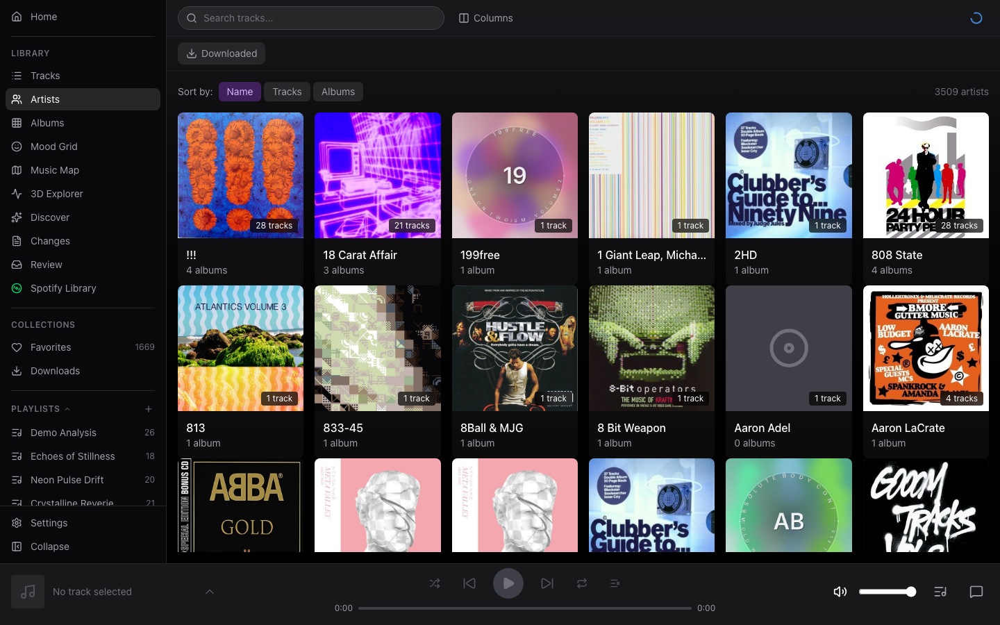 | 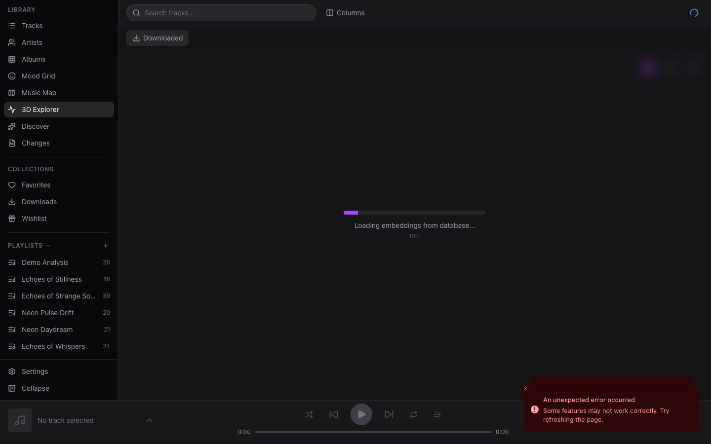 |

| Music Map | Mood Grid |
|:--:|:--:|
| 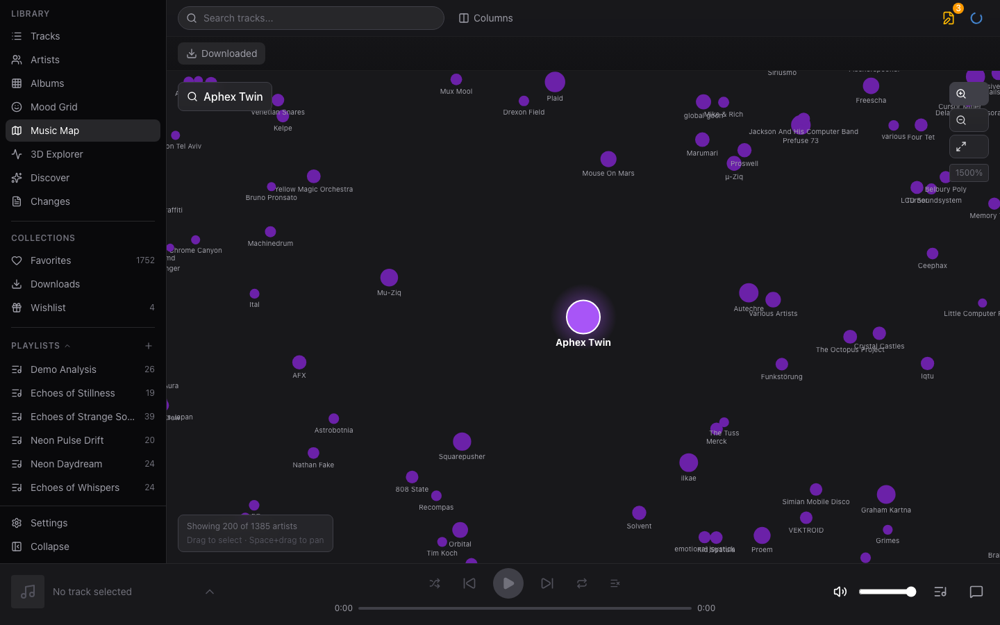 | 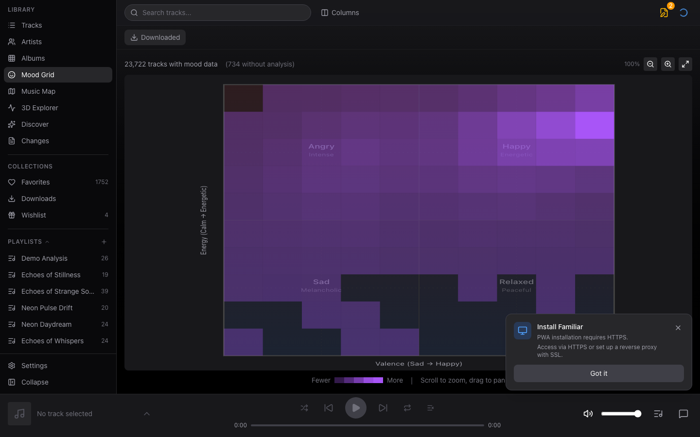 |

<details>
<summary><strong>More screenshots</strong></summary>

| Albums | Discover |
|:--:|:--:|
| 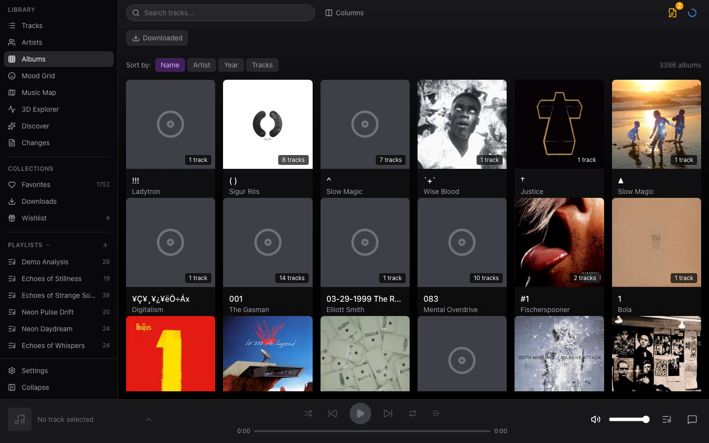 | 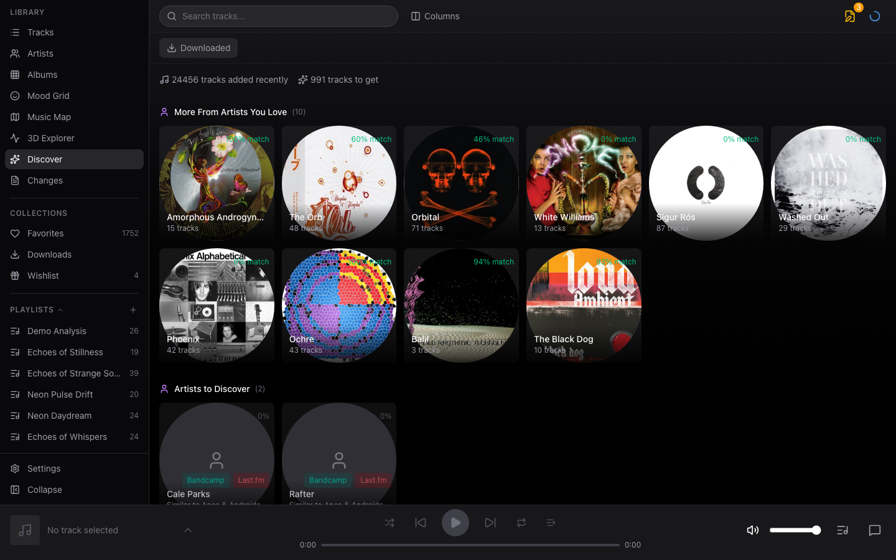 |

| Full Player | Playlist Detail |
|:--:|:--:|
| 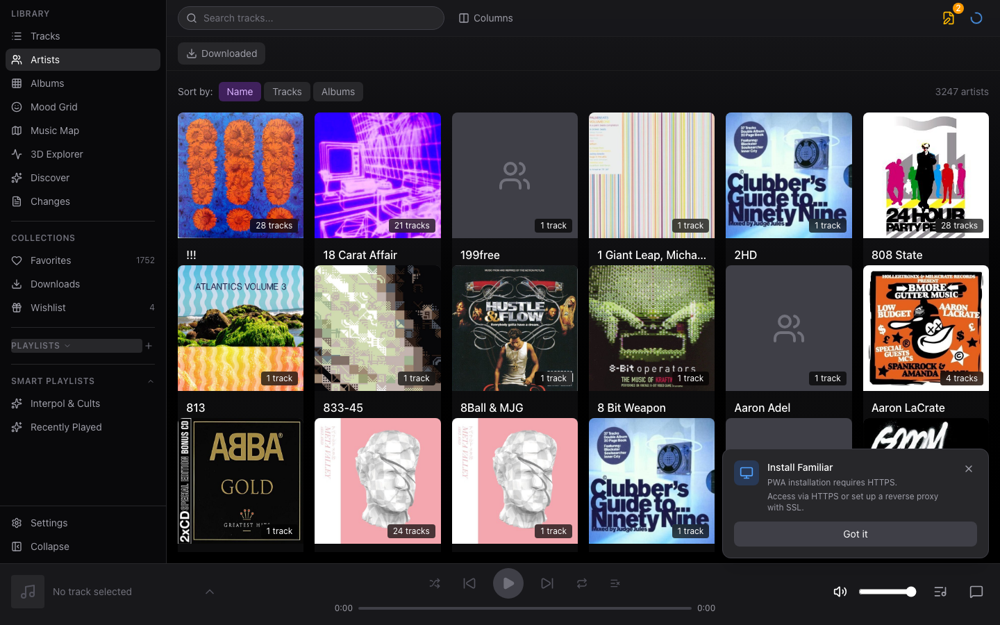 | 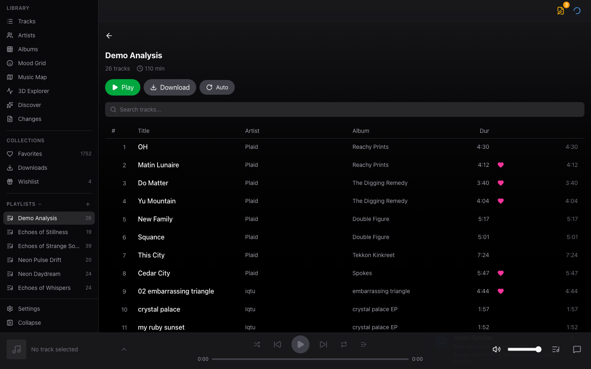 |

| Settings | Admin Setup |
|:--:|:--:|
| 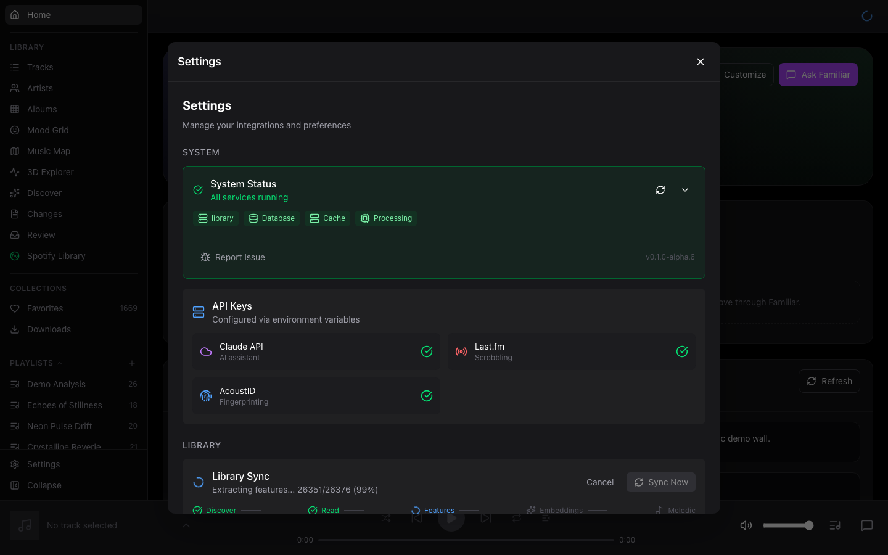 | 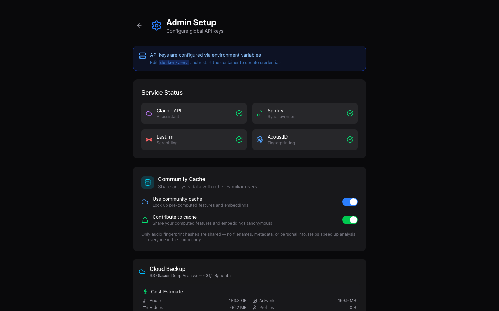 |

### Mobile Interface

| Library (Mobile) | Full Player (Mobile) |
|:--:|:--:|
| 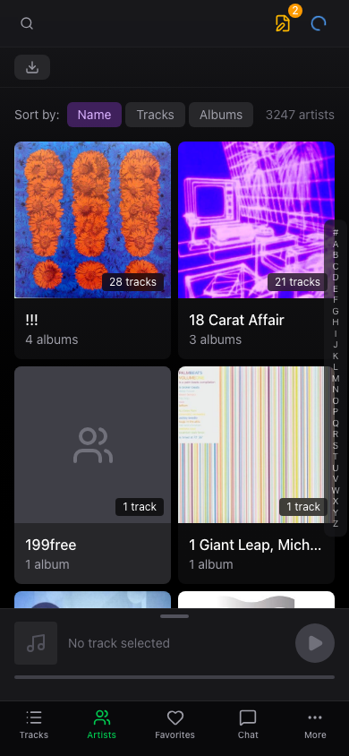 | 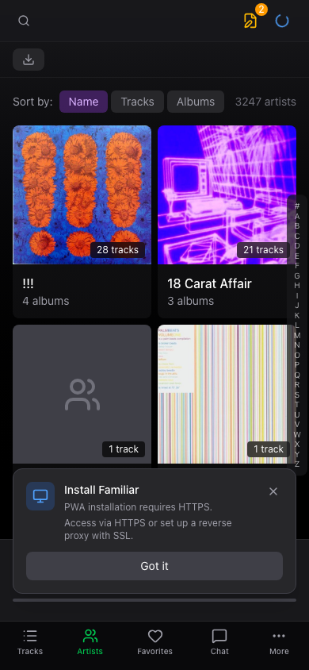 |

</details>

## Features

### Discovery & Search
- **Semantic audio search** - Describe the sound you want: "upbeat with synths", "acoustic and melancholy"
- **AI chat assistant** - 27 tools for search, playback, metadata correction, and playlist creation
- **Find similar tracks** - Click any track to find sonically similar music via CLAP embeddings
- **Mood Grid** - 2D scatter plot by energy and valence (happy/sad × calm/energetic)
- **Music Map** - Ego-centric similarity map. Click any artist to center the view
- **3D Explorer** - Navigate a 3D space of artists with hover-to-preview audio

<details>
<summary><strong>Available AI Tools (27)</strong></summary>

| Tool | Description |
|------|-------------|
| **Search & Discovery** | |
| `search_library` | Text search across title, artist, album, genre |
| `semantic_search` | Natural language search by mood/style via CLAP embeddings |
| `find_similar_tracks` | Find sonically similar tracks using audio embeddings |
| `filter_tracks` | Filter by BPM, energy, key, danceability, valence, favorites, play history |
| `get_similar_artists_in_library` | Find similar artists (via Last.fm) that exist in your library |
| **Library Info** | |
| `get_library_stats` | Total tracks, artists, albums, top genres |
| `get_library_genres` | List all genres with track counts |
| `get_visible_tracks` | Get tracks currently shown in the UI |
| `get_track_details` | Detailed track info including audio features |
| `get_track_analysis` | Deep musical analysis (harmonic, melodic, rhythmic, structural) |
| **Playback** | |
| `queue_tracks` | Add tracks to the playback queue |
| `control_playback` | Play, pause, next, previous, shuffle |
| `select_diverse_tracks` | Ensure variety across artists/albums |
| `create_playlist_from_items` | Create playlist from a list of artists/albums/tracks |
| **Discovery** | |
| `search_bandcamp` | Search Bandcamp for albums/tracks to purchase |
| `recommend_bandcamp_purchases` | Suggest albums based on your listening history |
| `get_feature_distribution` | Get statistical distribution of audio features |
| `get_available_mood_tags` | List all mood/genre/style tags available for filtering |
| `fetch_webpage` | Extract music references from a URL for playlist creation |
| **Metadata Correction** | |
| `lookup_correct_metadata` | Look up correct metadata from MusicBrainz |
| `propose_metadata_change` | Propose a metadata fix for user review |
| `get_album_tracks` | Get all tracks from a specific album |
| `mark_album_as_compilation` | Set album_artist for compilation albums |
| `propose_album_artwork` | Search and propose album artwork from Cover Art Archive |
| `find_duplicate_artists` | Find artists with variant spellings |
| `merge_duplicate_artists` | Propose merging duplicate artist names |
| **Track Identification** | |
| `identify_track` | Find a track by title and artist in library or externally |

</details>

### Playback & Experience
- **Synced lyrics** - Auto-scrolling lyrics display fetched from LRCLIB.net
- **6 audio visualizers** - Cosmic Orb, Frequency Bars, Album Kaleidoscope, Rain Window, Lyrics, Music Video
- **Music video playback** - Download and match music videos from YouTube
- **Keyboard shortcuts** - Full keyboard control (press `?` for help)
- **Multi-profile support** - Each household member gets their own favorites and history

### Library Management
- **Fast scanning with community cache** - Pre-computed analysis from other users speeds up initial scan
- **Audio analysis** - BPM, key detection, energy, danceability, and more via librosa
- **CLAP embeddings** - Semantic audio search powered by LAION's CLAP model
- **Smart playlists** - Dynamic playlists with rules for BPM, key, energy, genre, and more
- **Metadata editing** - Right-click to edit, AI-assisted corrections, duplicate artist detection
- **AcoustID fingerprinting** - Identify unknown tracks
- **Cloud backup** - S3 Glacier Deep Archive backup (~$1/TB/month) with scheduled backups and restore

### Mobile & Offline
- **PWA support** - Install on mobile or desktop, works offline
- **Download tracks** - Cache music for offline playback
- **Lock screen controls** - Media notifications and controls
- **Works over Tailscale** - Access your library anywhere with HTTPS

### Integrations
- **Last.fm scrobbling** - Automatic scrobbling, love/unlove tracks
- **Bandcamp discovery** - Search and get purchase recommendations

## Quick Start

```bash
git clone https://github.com/seethroughlab/familiar.git
cd familiar/docker
cp .env.example .env
# Edit .env: set MUSIC_LIBRARY_PATH and FRONTEND_URL
docker compose -f docker-compose.prod.yml up -d
```

Access at http://localhost:4400. API keys are configured in your `.env` file — open **Settings** (gear icon) to manage your library and start a scan.

**Running on macOS?** See the **[macOS Installation Guide](docs/MACOS.md)** — covers Docker Desktop setup, Apple Silicon, and music library paths.

See the **[Installation Guide](docs/INSTALLATION.md)** for other platforms (OpenMediaVault, Synology NAS, development setup).

## Requirements

- Docker Engine 24.0+ / Docker Compose v2
- 2 GB RAM minimum (4 GB recommended for large libraries)
- x86_64 or ARM64 (ARM64: CLAP embeddings can be disabled if needed)
- Music library accessible via filesystem mount

## Keyboard Shortcuts

Press `?` anytime to see all shortcuts.

| Key | Action |
|-----|--------|
| `Space` | Play / Pause |
| `←` / `→` | Previous / Next track |
| `↑` / `↓` | Volume up / down |
| `J` / `L` | Seek backward / forward 10s |
| `S` | Toggle shuffle |
| `R` | Cycle repeat mode |
| `M` | Mute / Unmute |
| `F` | Toggle full player |
| `Esc` | Close overlay |
| `?` | Show shortcuts help |

## Documentation

- **[Installation Guide](docs/INSTALLATION.md)** - Docker, OpenMediaVault, Synology NAS, and development setup
- **[macOS Guide](docs/MACOS.md)** - Docker Desktop setup, Apple Silicon, music library paths
- **[Configuration](docs/CONFIGURATION.md)** - Environment variables, API keys, Tailscale HTTPS, cloud backup
- **[Library Browser API](docs/LIBRARY_BROWSERS.md)** - Create custom 2D/3D library visualizations
- **[REST API Reference](docs/REST-API.md)** - Backend REST API documentation

## Coming Soon

Features planned for future releases:

### Listening Sessions (WebRTC) ([branch](https://github.com/seethroughlab/familiar/tree/feature/listening-sessions))
Share what you're listening to with friends in real-time. Host a session, share a link, and guests hear synchronized audio - no account required. Requires public signaling server deployment.

### Community Visualizer Plugins ([branch](https://github.com/seethroughlab/familiar/tree/feature/community-plugins))
Open API for community-created visualizers. Install plugins like Lyric Pulse (BPM-synced lyrics) and Timeline (visual track position) or create your own.

### Multi-Room Audio
Play to Sonos speakers and AirPlay devices in addition to browser audio. Control playback across multiple rooms with per-room volume controls.

### Additional LLM Providers
Support for more AI providers beyond Claude and Ollama, including OpenAI (ChatGPT), Google Gemini, and other compatible APIs.

## Beta Feedback

Familiar is in active development and we'd love your feedback!

**What's most helpful:**
- Bug reports with steps to reproduce
- Feature requests with use cases
- Performance issues (especially on NAS devices)
- UI/UX suggestions

**How to report:**
- [GitHub Issues](https://github.com/seethroughlab/familiar/issues) - Bugs and feature requests
- Include your platform, Docker version, and relevant logs (`docker logs familiar-api`)

## Project Structure

```
familiar/
├── backend/          # Python FastAPI backend
│   ├── app/
│   │   ├── api/      # API routes
│   │   ├── db/       # Database models
│   │   ├── services/ # Business logic + background tasks
│   │   └── utils/    # Utilities
│   └── tests/
├── frontend/         # React + TypeScript PWA
│   ├── src/
│   │   ├── api/      # API client modules
│   │   ├── components/
│   │   ├── hooks/
│   │   ├── player/   # Audio engine, stores, persistence
│   │   ├── services/ # Offline, sync services
│   │   └── stores/   # Zustand state
├── docker/           # Docker configuration
└── docs/             # Documentation
```

## Contributing

Contributions are welcome! Please read our contributing guidelines before submitting PRs.

## License

MIT License - see [LICENSE](LICENSE) for details.
