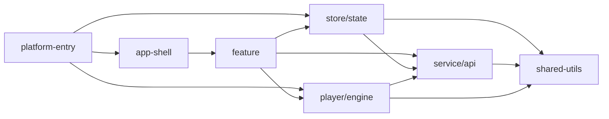

# Frontend Architecture & Boundaries Audit (Phase 1)

## Summary
This audit covers frontend organization and module boundaries across:
- `packages/frontend/src`
- `packages/web/src`
- `packages/ios/src`

Outputs produced:
- Boundary rules: `docs/frontend-architecture-boundary-rules.md`
- Prioritized backlog: `docs/frontend-architecture-issue-backlog.md`
- CI guardrails proposal: `docs/frontend-ci-boundary-guardrails-proposal.md`

## Module Ownership Map

### Package/Layer Distribution (non-test TS/TSX files)
| Package | platform-entry | app-shell | feature | store/state | service/api | player/engine | shared-utils |
|---|---:|---:|---:|---:|---:|---:|---:|
| `packages/frontend/src` | 0 | 2 | 201 | 16 | 22 | 11 | 12 |
| `packages/web/src` | 1 | 0 | 15 | 0 | 0 | 0 | 0 |
| `packages/ios/src` | 1 | 0 | 0 | 0 | 0 | 2 | 0 |

### Top-Level Frontend Structure (`packages/frontend/src`)
- `components`: 175 files
- `hooks`: 37 files
- `stores`: 20 files
- `player`: 16 files
- `services`: 15 files
- `api`: 14 files
- `utils`: 13 files
- `db`: 2 files

## Dependency Directions: Allowed vs Actual

### Allowed High-Level Flow

### Observed Violating Edges (from static import scan)
- `service/api -> store/state`
- `store/state -> feature`
- `shared-utils -> store/state`
- `player/engine -> feature`
- `platform-entry -> service/api` (outside explicit registration seam)

See concrete examples and file refs in:
- `docs/frontend-architecture-boundary-rules.md`

## Coupling / God-Module Signals
Thresholds used:
- LOC > 600
- imports > 20
- exports > 15

High-signal modules:
- `packages/frontend/src/components/Library/browsers/TrackListBrowser.tsx` (1594 LOC, 27 imports)
- `packages/frontend/src/player/playerStore.ts` (1098 LOC)
- `packages/frontend/src/components/Library/ArtistDetail.tsx` (865 LOC, 23 imports)
- `packages/frontend/src/services/offlineService.ts` (677 LOC, 22 exports)
- `packages/frontend/src/api/backup.ts` (619 LOC, 34 exports)

## Store Architecture Notes
Zustand store consumption is highly concentrated around:
- `usePlayerStore`: used across player hooks + queue/full-player/library/playlist surfaces.
- `useUIStore`: App shell and multiple navigation surfaces.
- `useDownloadStore`: playlists, favorites, library album/artist paths.

Boundary anomalies:
- `visualizerStore` depends on component-layer constants (`components/Visualizer/types.ts`).
- `syncService` and `errorNotifications` depend on toast store APIs (service/utils to store coupling).

## Registration Pattern Compliance
Compliant registration seams found:
- `registerEngineFactory` used in `packages/web/src/main.tsx` and `packages/ios/src/main.tsx`
- `registerNativeEffectsSync` used in `packages/ios/src/main.tsx`
- `registerPreferencesProvider` used in `packages/ios/src/main.tsx`

Current seam drift risk:
- Platform/runtime checks are spread through shared package (`api/base.ts`, `utils/platform.ts`, `player/audio/platform.ts`, `services/offlineService.ts`, `stores/connectivityStore.ts`) instead of a single adapter module.

## Evidence Completeness / Reproducibility
All `P0/P1` items in backlog include:
- concrete file references
- violated boundary rule
- effort + blast radius + entrypoint

Reproducibility commands and proposed CI checks:
- `docs/frontend-ci-boundary-guardrails-proposal.md`
